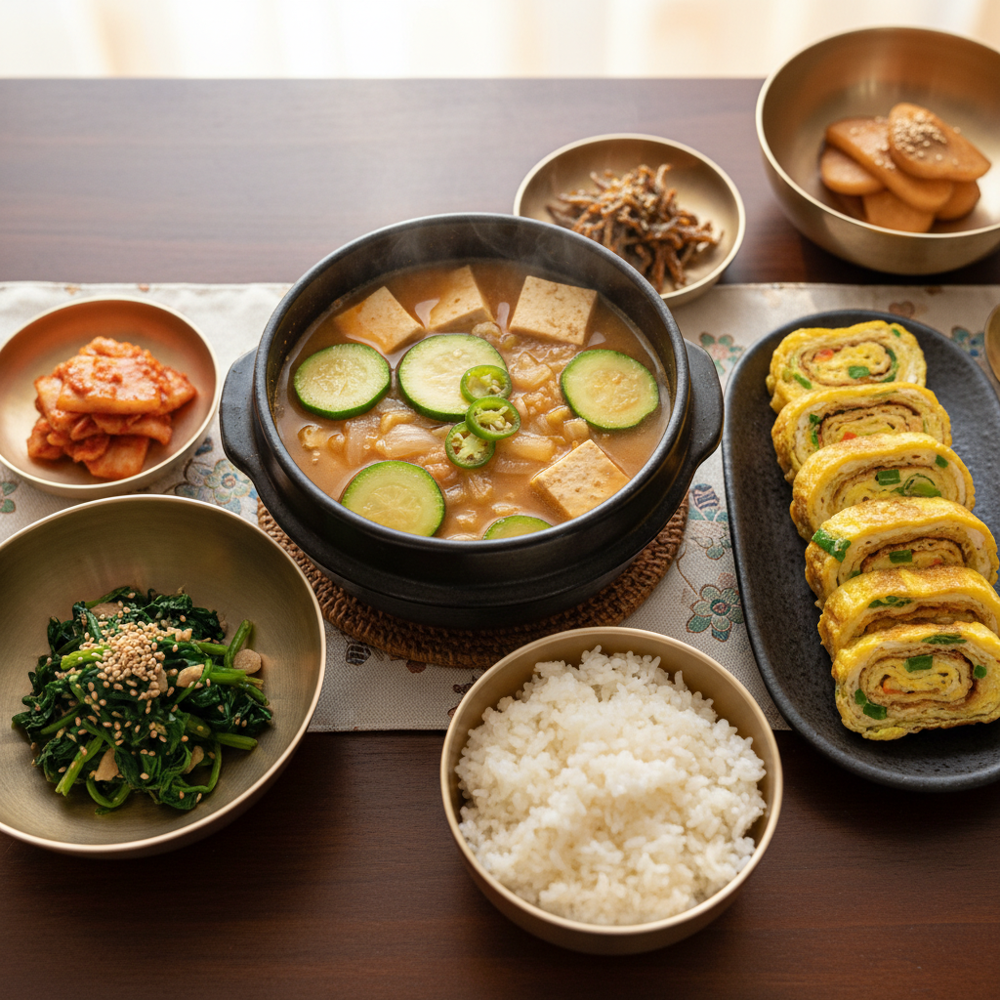

# 🍽️ 오늘의 저녁 메뉴

## 메인 요리: 된장찌개

### 재료 (2인분)
- 된장 2큰술
- 두부 1/2모
- 애호박 1/3개
- 양파 1/2개
- 청양고추 1개
- 대파 1/2대
- 다진 마늘 1작은술
- 멸치육수 또는 물 2컵

### 만드는 법
1. 냄비에 멸치육수(또는 물)를 붓고 된장을 풀어 끓인다.
2. 양파, 애호박을 한입 크기로 썰어 넣는다.
3. 끓어오르면 두부와 다진 마늘을 넣는다.
4. 청양고추와 대파를 썰어 넣고 한소끔 더 끓인다.
5. 간을 보고 부족하면 된장을 추가한다.

---

## 곁들임 1: 계란말이

### 재료
- 계란 3개
- 당근 약간
- 대파 약간
- 소금 약간
- 식용유

### 만드는 법
1. 계란을 풀고 잘게 썬 당근, 대파, 소금을 넣어 섞는다.
2. 약불로 달군 팬에 기름을 두르고 계란물을 얇게 붓는다.
3. 익으면 돌돌 말아가며 모양을 잡는다.
4. 한 김 식힌 후 먹기 좋게 썬다.

---

## 곁들임 2: 시금치 무침

### 재료
- 시금치 1줌
- 국간장 1작은술
- 다진 마늘 1/2작은술
- 참기름 1작은술
- 깨소금 약간

### 만드는 법
1. 시금치를 끓는 물에 살짝 데친 후 찬물에 헹군다.
2. 물기를 꼭 짠다.
3. 국간장, 마늘, 참기름, 깨소금을 넣고 무친다.

---

## 밥
- 따뜻한 흰쌀밥 2공기

> 💡 **Tip:** 된장찌개는 마지막에 청양고추를 넣어야 칼칼한 맛이 살아납니다.
