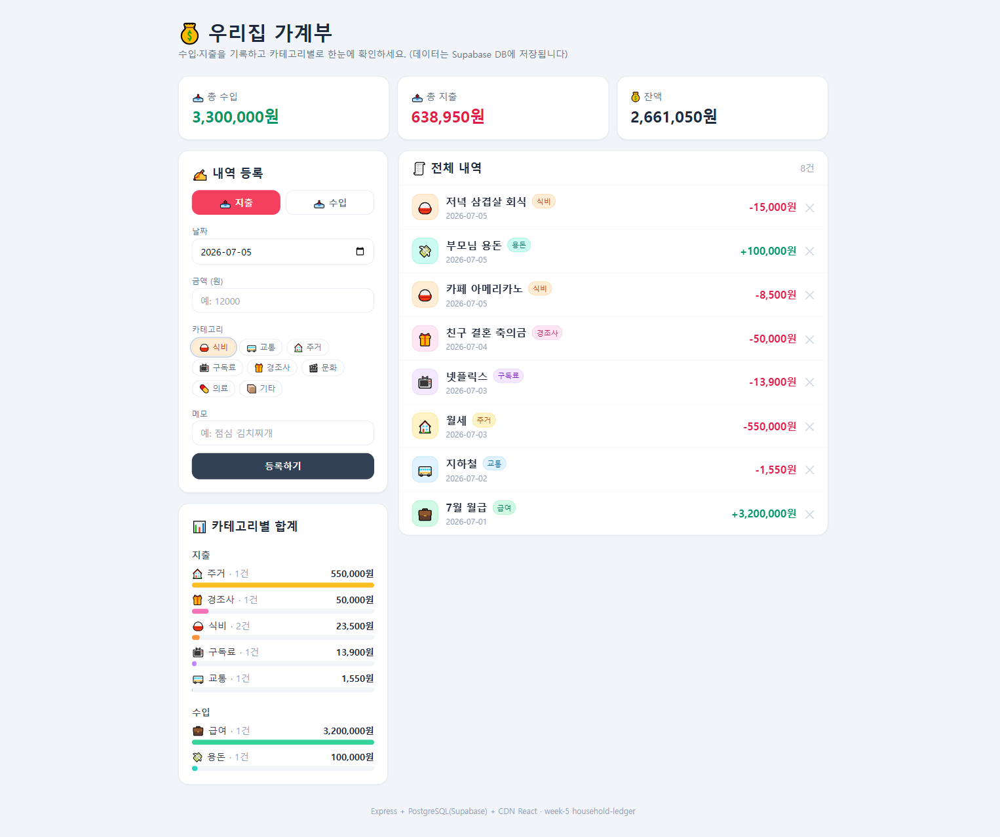

# 💰 우리집 가계부 (household-ledger)

수입/지출 내역을 등록하고, 목록으로 조회하며, **카테고리별 합계**를 확인하는 가계부 웹앱입니다.
모든 데이터는 **Supabase(PostgreSQL)** 에 저장됩니다.

## 미션 충족 항목

1. ✅ 수입/지출 내역 등록 — 날짜 · 금액 · 카테고리 · 메모
2. ✅ 등록된 내역 목록 조회 (최신순)
3. ✅ 카테고리별 합계 (식비 · 교통 · 주거 · 구독료 · 경조사 등) + 총수입/총지출/잔액
4. ✅ 모든 데이터 DB(Supabase) 저장

## 핵심 구조

```
[사용자 입력 (금액, 카테고리, 메모)]
      → [Express Server]
      → Supabase(PostgreSQL) 에 수입/지출 저장
      → 내역 조회 & 카테고리별 합계(SQL GROUP BY) 계산
      → 결과 응답 → React UI 렌더링
```

- **DB 역할:** 수입/지출 내역 저장소 + 카테고리별 통계 조회 (`ledger_entries` 테이블)
- **Server 역할:** CRUD API 제공 (등록 · 조회 · 수정 · 삭제) + 통계 집계

## 기술 스택

- Backend: Node.js + Express 5, `pg` (PostgreSQL 드라이버)
- DB: Supabase (PostgreSQL, Transaction Pooler)
- Frontend: CDN 기반 React 18 + Tailwind CSS (빌드 도구 없이 단일 `index.html`)

## API

| Method | Path | 설명 |
|--------|------|------|
| GET    | `/api/entries`      | 전체 내역 조회 (최신순) |
| GET    | `/api/summary`      | 카테고리별 합계 + 총수입/총지출/잔액 |
| POST   | `/api/entries`      | 내역 등록 (`type`, `date`, `amount`, `category`, `memo`) |
| PATCH  | `/api/entries/:id`  | 내역 수정 (변경 필드만) |
| DELETE | `/api/entries/:id`  | 내역 삭제 |

### DB 스키마 (`ledger_entries`)

| 컬럼 | 타입 | 설명 |
|------|------|------|
| id | SERIAL PK | 고유 번호 |
| type | TEXT | `income` \| `expense` |
| entry_date | DATE | 내역 날짜 |
| amount | BIGINT | 금액(원, 정수) |
| category | TEXT | 카테고리 |
| memo | TEXT | 메모 |
| created_at | TIMESTAMPTZ | 생성 시각 |

## 실행 방법

```bash
cd week-5/household-ledger
cp .env.example .env      # DATABASE_URL 에 Supabase 비밀번호 입력
npm install
npm start                 # http://localhost:3000
```

> 테이블은 서버 시작 시 자동 생성되며, 비어 있으면 예시 데이터가 시드됩니다.

## 스크린샷

### 동작 화면


## 🤖 에이전트에게 DB 연결하기 (분석·조언)

가계부 앱이 데이터를 쌓는 **같은 Supabase DB**에 AI 에이전트(Claude Code)를 연결하면,
자연어로 소비 패턴을 분석하고 절약 조언까지 받을 수 있습니다.

```
[가계부 앱으로 데이터 쌓기] → [에이전트가 Supabase DB 접속] → [질문]
     → DB 조회 + AI 분석 → [맞춤형 답변]
```

### 연결 방법 — Postgres MCP 서버

가계부와 동일한 `DATABASE_URL` 로 read-only Postgres MCP 서버를 붙입니다.

```bash
# .env 의 DATABASE_URL 을 그대로 사용
claude mcp add postgres-ledger -- cmd /c npx -y @modelcontextprotocol/server-postgres "<DATABASE_URL>"
claude mcp get postgres-ledger   # Status: ✔ Connected 확인
```

> 연결 후 Claude Code 를 재시작하면 `postgres-ledger` 의 `query` 도구가 로드되어
> "이번 달 얼마 썼어?" 처럼 자연어로 물어볼 수 있습니다.

### 물어볼 수 있는 질문 예시

- **조회:** "이번 달 얼마 썼어?", "식비로 가장 많이 쓴 날은?", "교통비 월평균 얼마야?"
- **패턴 분석:** "주중 vs 주말 지출 비교해줘", "요일별 지출이 가장 많은 날은?", "카테고리별 비율 알려줘"
- **절약 조언:** "줄일 수 있는 소비 추천해줘", "이번 달 50만원 예산이면 남은 예산은?", "이 속도면 연말까지 얼마 쓸까?"

### 데모용 샘플 데이터

분석이 의미 있도록 `seed-sample-data.js` 로 2026-06-01 ~ 07-05 약 5주치(121건)의
현실적인 수입/지출 패턴을 생성할 수 있습니다. (실제 사용 시 본인 데이터로 대체)

```bash
node seed-sample-data.js
```

## 배포 (Vercel)

`vercel.json` 이 포함되어 있어 Vercel 에 그대로 배포 가능합니다.
배포 시 프로젝트 환경변수에 `DATABASE_URL` 을 등록하세요.
